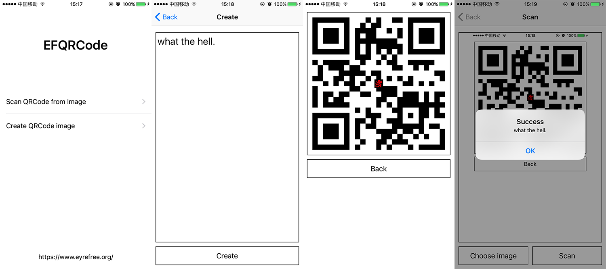
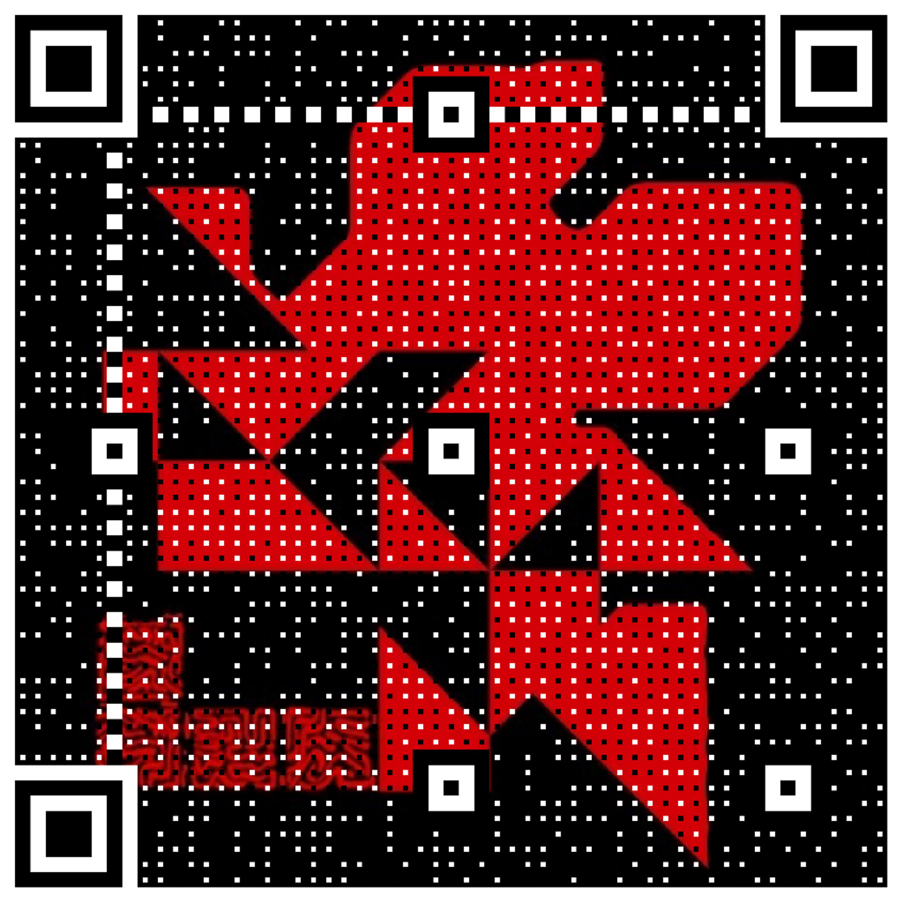

[](https://travis-ci.org/EyreFree/EFQRCode)
[](http://cocoapods.org/pods/EFQRCode)
[](https://github.com/EyreFree/EFQRCode/blob/master/LICENSE)
[](http://cocoapods.org/pods/EFQRCode)
[](https://travis-ci.org/EyreFree/EFQRCode)
[](https://gitter.im/EFQRCode/Lobby)

EFQRCode 是一个用 Swift 编写的用来创建和扫描二维码的库，它基于系统二维码生成与识别进行开发。

- 生成：能够生成各种艺术二维码
- 识别：识别率比 iOS 原生二维码识别率更高

> [English Introduction](https://github.com/EyreFree/EFQRCode/blob/master/README.md)

## 概述



## 示例

1. 利用 `git clone` 命令下载本仓库；
2. 利用 cd 命令切换到 Example 目录下，执行 `pod install` 命令；
3. 随后打开 `EFQRCode.xcworkspace` 编译即可。

或执行以下命令：

```bash
git clone git@github.com:EyreFree/EFQRCode.git; cd EFQRCode/Example; pod install; open EFQRCode.xcworkspace
```

## 环境

- XCode 8.0+
- Swift 3.0+

## 导入

EFQRCode 可以通过 [CocoaPods](http://cocoapods.org) 进行获取。只需要在你的 Podfile 中添加如下代码就能实现引入：


```
pod "EFQRCode", '~> 1.1.0'
```

## 使用

#### 1. 在你需要使用的地方添加如下代码引入 EFQRCode 模块：

```swift
import EFQRCode
```

#### 2. 获取图片中所包含的二维码，同一张图片中可能包含多个二维码，所以返回值是一个字符串数组：

```swift
if let testImage = UIImage(named: "test.png") {
	let codes = EFQRCode.GetQRCodeString(From: testImage)
	if codes.count > 0 {
		print("There are \(codes.count) codes in testImage.")
		for (index, code) in codes.enumerated() {
			print("The content of \(index) QR Code is: \(code).")
		}
	} else {
		print("There is no QR Codes in testImage.")
	}
}
```

#### 3. 创建二维码图片:

```swift
//                          string: 二维码内容
// inputCorrectionLevel (Optional): 容错率
// 		                            L 7%
// 		                            M 15%
// 		                            Q 25%
// 		                            H 30%
//                 size (Optional): 边长
//              quality (Optional): 质量
//            backColor (Optional): 背景色
//           frontColor (Optional): 前景色
//                 icon (Optional): 中心图标
//             iconSize (Optional): 中心图标边长
//         iconColorful (Optional): 中心图标是否为彩色
//            watermark (Optional): 水印图
//        watermarkMode (Optional): 水印图模式
//    watermarkColorful (Optional): 水印图是否为彩色
```

```swift
if let tryImage = EFQRCode.createQRImage(
    string: "https://github.com/EyreFree/EFQRCode",
    inputCorrectionLevel: .h,
    size: 750,
    quality: .low,
    backColor: .white,
    frontColor: .black,
    icon: nil,
    iconSize: nil,
    iconColorful: true,
    watermark: UIImage(named: "eyrefree"),
    watermarkMode: .scaleAspectFill,
    watermarkColorful: false
    ) {
    print("Create QRCode image success!")
} else {
    print("Create QRCode image failed!")
}
```

结果：


## 输出

|||  
:---------------------:|:---------------------:|:---------------------:|:---------------------:
|||  

## 备注

1. 请选用对比度较高的前景色和背景色组合；
2. 想要提高生成二维码的清晰度可以选择提高质量和二维码边长；
3. 质量过高／边长过大／二维码内容过多可能会导致生成失败；
4. 建议对生成的二维码进行测试后投入使用，例如微信能够扫描成功并不代表支付宝也能成功扫描，请您务必做有针对性的具体测试；
5. 若有任何问题，期待得到您的反馈，Issue 和 Pull request 都是受欢迎的。

备注的备注：好用的话可以给个`星星`，蟹蟹，QAQ...

## 作者

EyreFree, eyrefree@eyrefree.org

## 协议

EFQRCode 基于 MIT 协议进行分发和使用，更多信息参见协议文件。
