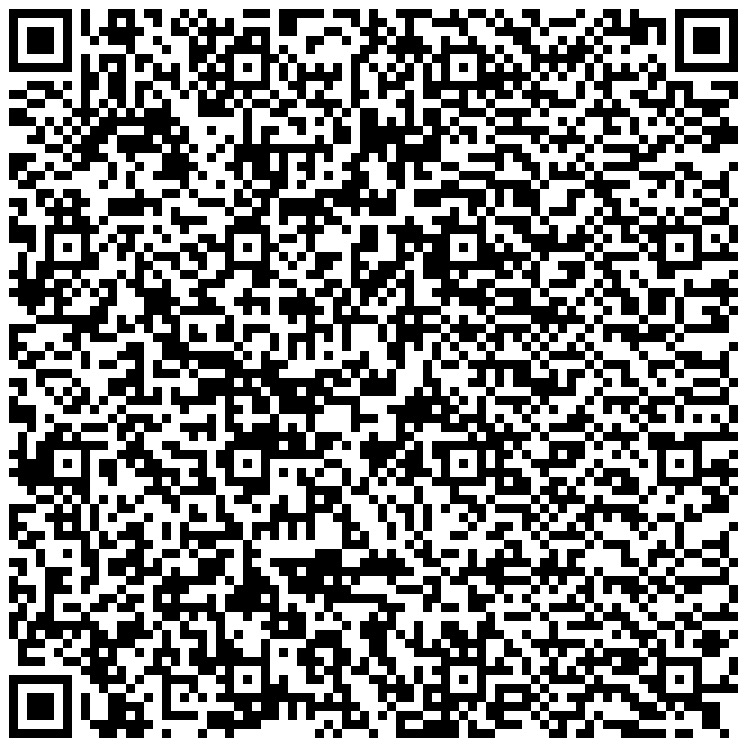

<p align="center">
<a href="https://travis-ci.org/EyreFree/EFQRCode"></a>
<a href="https://codecov.io/gh/EyreFree/EFQRCode"></a>
<a href="https://swift.org/package-manager/"></a>
<a href="http://cocoapods.org/pods/EFQRCode"></a>
<a href="https://raw.githubusercontent.com/EyreFree/EFQRCode/master/LICENSE"></a>
<a href="http://cocoapods.org/pods/EFQRCode"></a>
<a href="https://travis-ci.org/EyreFree/EFQRCode"></a>
<a href="https://gitter.im/EFQRCode/Lobby"></a>
<a href="https://codebeat.co/projects/github-com-eyrefree-efqrcode-master"></a>
</p>

EFQRCode 是一个用 Swift 编写的用来生成和识别二维码的库，它基于系统二维码生成与识别进行开发。

- 生成：利用输入的水印图/图标等资源生成各种艺术二维码；
- 识别：识别率比 iOS 原生二维码识别率更高。

> [English Introduction](https://github.com/EyreFree/EFQRCode/blob/master/README.md)

## 概述

|||  
:---------------------:|:---------------------:|:---------------------:|:---------------------:
|||  

## 示例

1. 利用 `git clone` 命令下载本仓库；
2. 利用 cd 命令切换到 Example 目录下，执行 `pod install` 命令；
3. 随后打开 `EFQRCode.xcworkspace` 编译即可。

或执行以下命令：

```bash
git clone git@github.com:EyreFree/EFQRCode.git; cd EFQRCode/Example; pod install; open EFQRCode.xcworkspace
```

## 环境

- XCode 8.0+
- Swift 3.0+

## 安装

### CocoaPods

EFQRCode 可以通过 [CocoaPods](http://cocoapods.org) 进行获取。只需要在你的 Podfile 中添加如下代码就能实现引入：

```
pod "EFQRCode", '~> 1.2.0'
```

## 快速使用

#### 1. 导入 EFQRCode

在你需要使用的地方添加如下代码引入 EFQRCode 模块：

```swift
import EFQRCode
```

#### 2. 二维码识别

获取图片中所包含的二维码，同一张图片中可能包含多个二维码，所以返回值是一个字符串数组：

```swift
if let testImage = UIImage(named: "test.png") {
    if let tryCodes = EFQRCode.recognize(image: testImage) {
        if tryCodes.count > 0 {
            print("There are \(tryCodes.count) codes in testImage.")
            for (index, code) in tryCodes.enumerated() {
                print("The content of \(index) QR Code is: \(code).")
            }
        } else {
            print("There is no QR Codes in testImage.")
        }
    } else {
        print("Recognize failed, check your input image!")
    }
}
```

#### 3. 二维码生成

根据所输入参数创建各种艺术二维码图片，快速使用方式如下:

```swift
// 常用参数:
//                         content: 二维码内容
// inputCorrectionLevel (Optional): 容错率
//                                  L 7%
//                                  M 15%
//                                  Q 25%
//                                  H 30%(默认值)
//                 size (Optional): 边长
//        magnification (Optional): 放大倍数
//                                  (如果 magnification 不为空，将会忽略 size 参数)
//      backgroundColor (Optional): 背景色
//      foregroundColor (Optional): 前景色
//                 icon (Optional): 中心图标
//             iconSize (Optional): 中心图标边长
//       isIconColorful (Optional): 中心图标是否为彩色
//            watermark (Optional): 水印图
//        watermarkMode (Optional): 水印图模式
//  isWatermarkColorful (Optional): 水印图是否为彩色

// 额外参数
//           foregroundPointOffset: 前景点偏移量
//                allowTransparent: 允许透明
```

```swift
if let tryImage = EFQRCode.generate(
    content: "https://github.com/EyreFree/EFQRCode",
    magnification: 9,
    watermark: UIImage(named: "WWF"),
    watermarkMode: .scaleAspectFill,
    isWatermarkColorful: false
) {
    print("Create QRCode image success!")
} else {
    print("Create QRCode image failed!")
}
```

结果：


## 详细说明

### 1. 二维码识别

```
EFQRCode.recognize(image: UIImage)
```

或

```
EFQRCodeRecognizer(image: image).contents
```

以上两种写法是完全相等的，因为传入的图片中可能包好多个二维码，所以返回值为 `[String]?`，若返回 nil 则表示传入数据有误或为空，若返回数组为空则表示图片上未识别到二维码。

### 2. 二维码生成

```
EFQRCode.generate(
    content: String, 
    inputCorrectionLevel: EFInputCorrectionLevel, 
    size: CGFloat, 
    magnification: UInt?, 
    backgroundColor: UIColor, 
    foregroundColor: UIColor, 
    icon: UIImage?, 
    iconSize: CGFloat?, 
    isIconColorful: Bool, 
    watermark: UIImage?, 
    watermarkMode: EFWatermarkMode, 
    isWatermarkColorful: Bool
)
```

或

```
EFQRCodeGenerator(
    content: content,
    inputCorrectionLevel: inputCorrectionLevel,
    size: size,
    magnification: magnification,
    backgroundColor: backgroundColor,
    foregroundColor: foregroundColor,
    icon: icon,
    iconSize: iconSize,
    isIconColorful: isIconColorful,
    watermark: watermark,
    watermarkMode: watermarkMode,
    isWatermarkColorful: isWatermarkColorful
).image
```

以上两种写法是完全相等的，返回值为 `UIImage?`，若返回 nil 则表示生成失败。

若需要使用额外参数，则必须使用创建 EFQRCodeGenerator 对象的方式：

```
let generator = EFQRCodeGenerator(
    content: content,
    inputCorrectionLevel: inputCorrectionLevel,
    size: size,
    magnification: magnification,
    backgroundColor: backColor,
    foregroundColor: frontColor,
    icon: icon,
    iconSize: iconSize,
    isIconColorful: iconColorful,
    watermark: watermark,
    watermarkMode: watermarkMode,
    isWatermarkColorful: watermarkColorful
)
generator.foregroundPointOffset = self.foregroundPointOffset
generator.allowTransparent = self.allowTransparent

// 最终生成的二维码
generator.image
```

参数比较：

* **content: String?**

二维码内容，有容量限制，最大为 424 个汉字（或 1273 个英文字母），二维码点阵越密集程度随内容增加而提高。不同容量对比如下：

10 个字母 | 250 个字母
:-------------------------:|:-------------------------:
|

* **inputCorrectionLevel: EFInputCorrectionLevel**

容错率，可选值，有四个等级，L：7%／M 15%／Q 25%／H 30%，默认值为最高容错等级 H，枚举类型 EFInputCorrectionLevel 定义如下：

```
// EFInputCorrectionLevel
public enum EFInputCorrectionLevel: Int {
    case l = 0;     // L 7%
    case m = 1;     // M 15%
    case q = 2;     // Q 25%
    case h = 3;     // H 30%
}
```

同一内容不同容错率对比如下：

L | M | Q | H
:-------------------------:|:-------------------------:|:-------------------------:|:-------------------------:
|||

* **size: CGFloat**

生成的二维码边长，可选值，默认为 256（PS：如果 magnification 不为空，将会忽略 size 参数）。

* **magnification: UInt?**

放大倍数，可选值，默认为 nil。因为按照 size 缩放二维码存在清晰度不高的问题，如果希望得到比较清晰的二维码，可以使用 magnification 来设定最终生成的二维码大小。这里的倍数是相对于最小的二维码点阵而言的，如果已有一个想要的 size 但是希望通过使用 magnification 获得一个清晰且大小和自己所要 size 近似的二维码，可以通过 `maxMagnificationLessThanOrEqualTo(size: CGFloat)` 和 `minMagnificationGreaterThanOrEqualTo(size: CGFloat)` 这两个函数来获得想要的 magnification 具体值，具体使用方法如下：

```
let generator = EFQRCodeGenerator(
    content: content,
    inputCorrectionLevel: inputCorrectionLevel,
    size: size,
    magnification: magnification,
    backgroundColor: backColor,
    foregroundColor: frontColor,
    icon: icon,
    iconSize: iconSize,
    isIconColorful: iconColorful,
    watermark: watermark,
    watermarkMode: watermarkMode,
    isWatermarkColorful: watermarkColorful
)

// 希望获得最终 size 小于等于 600 的最大倍率
generator.magnification = generator.maxMagnificationLessThanOrEqualTo(size: 600)

// 或

// 希望获得最终 size 大于等于 600 的最小倍率
// generator.magnification = generator.minMagnificationGreaterThanOrEqualTo(size: 600)

// 最终生成的二维码
generator.image
```

size 300 | magnification 9
:-------------------------:|:-------------------------:
|

* **backgroundColor: UIColor**

前景色，可选值，二维码码点的颜色，默认为黑色。


* **foregroundColor: UIColor**

背景色，可选值，默认为白色。


* **icon: UIImage?**

二维码中心图标，可选值，默认为空。


* **iconSize: CGFloat?*

二维码中心图标变长，可选值，默认为最终二维码边长的 20%，这里设为 64 像素，可以和上一个二维码对比：


* **isIconColorful: Bool**

二维码中心图标是否为彩色，可选值，默认为彩色。

* **watermark: UIImage?**

水印图，可选值，默认为 nil，示例如下：

  1 | 2  
:-------------------------:|:-------------------------:
|

* **watermarkMode: EFWatermarkMode**

水印图放置于最终生成二维码的位置，可选值，默认为 scaleAspectFill，可参考 UIViewContentMode，将生成的二维码当作 UIImageView 理解即可，枚举类型 EFWatermarkMode 定义如下：

```
// Like UIViewContentMode
public enum EFWatermarkMode: Int {
    case scaleToFill        = 0;
    case scaleAspectFit     = 1;
    case scaleAspectFill    = 2;
    case center             = 3;
    case top                = 4;
    case bottom             = 5;
    case left               = 6;
    case right              = 7;
    case topLeft            = 8;
    case topRight           = 9;
    case bottomLeft         = 10;
    case bottomRight        = 11;
}
```

* **isWatermarkColorful: Bool**

水印图是否为彩色，可选值，默认为彩色。

* **foregroundPointOffset: CGFloat**

二维码码点偏移量，可选值，默认为 0，不建议使用，易造成二维码无法识别，对比如下：

0 | 0.5 
:-------------------------:|:-------------------------:
|

* **allowTransparent: Bool**

水印图穿透允许，可选值，默认为 true，对比如下：

true | false
:-------------------------:|:-------------------------:
|

## 备注

1. 请选用对比度较高的前景色和背景色组合；
2. 想要提高生成二维码的清晰度可以选择使用 `magnificatio` 替代 `size`，或适当提高它们的数值；
3. 放大倍数过高／边长过大／二维码内容过多可能会导致生成失败；
4. 建议对生成的二维码进行测试后投入使用，例如微信能够扫描成功并不代表支付宝也能成功扫描，请务必根据您的具体业务需要做有针对性的测试；
5. 若有任何问题，期待得到您的反馈，`Issue` 和 `Pull request` 都是受欢迎的。

备注的备注：好用的话可以给个`星星`，蟹蟹，QAQ...

## 作者

EyreFree, eyrefree@eyrefree.org

## 协议

EFQRCode 基于 MIT 协议进行分发和使用，更多信息参见协议文件。
